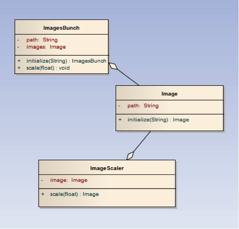

**Image converter.**

I wrote a lib which will scale the images. The only thing user will have
to do is to require it and run the convert command specifying a path to
a folder with images as a parameter. Second not obligatory parameter is
a scale ratio, default to 0.5 if it is not specified.

I got acquainted with this articles: [*7 Patterns to Refactor Fat Active
Record
Models*](http://blog.codeclimate.com/blog/2012/10/17/7-ways-to-decompose-fat-activerecord-models/)
and [*Unix
commands*](http://www.tutorialspoint.com/unix/unix-useful-commands.htm)
and made a small diagram representing classes.

To use as **library**:

1\) copy folder with library to your project;

2\) include images\_scaler.rb:

require './images\_scaler.rb'

3\) scale directory:

ImagesScaler::ImagesBunch.new('path/to/folder').scale(0.5)

To use as a **tool** **for non-programmers**:

1\) copy folder with library and get inside of it in a terminal;

2\) run "./scale /path/to/file" if you want to scale images by default
50%;

3\) run "./scale /path/to/file 0.4", specifying scale ratio as a second
parameter if you want to scale images by custom percentage;

**Exceptions** raised:

1\. User specifies non-existing directory.

2\. Image can't be found for some reasons.

3\. Any image\_magick error will be shown (for example when one of the
files was deleted before running scale function).

Warning shown when user specifies a directory without any image in it.

