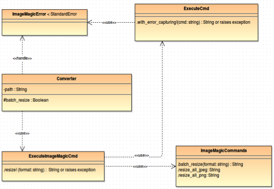

Batch convert library

My assumptions are:

1\) It does not matter what final size or resolution will be but aspect ratio remains.

2\) Only images with png and jpeg formats will be resized, the rest of
the images stay as it is.

3\) The name of resized image isn't very important. And it will be in the
form "image\_name.resized.format"

I was searching a lot to find best solution.

At first I looked into ImageMagic documentation:

[*http://www.imagemagick.org/script/convert.php*](http://www.imagemagick.org/script/convert.php)

[*http://www.imagemagick.org/script/mogrify.php*](http://www.imagemagick.org/script/mogrify.php)

ImageMagic function convert can be used for batch processing and it
doesn't modify original image BUT as explained here:
*http://www.imagemagick.org/Usage/basics/\#mogrify\_convert*

The real problem with using "convert" instead of "mogrify" is that ALL
the images are read into memory first! Mogrify takes great pains to only
read/modify/write one file (though that file could contain multiple
images) at a time. But "convert" does not. As such you can very easily
exceed memory limits if you are not careful. Off course I can use a loop
or something else to solve it but what's the point?

Because when I add additional option as '-format' to mogrify

(*http://www.imagemagick.org/script/command-line-options.php\#format*).

original image won't be overwritten.

But I began to think about the time that will take images converting.
Maybe I can reduce it? Because a lot of modern computers have multiple
independent processing units and using all of them should speed up the
process.

So I already found solution in the form of shell script and tried it. It
worked but as you suggested I step back and look at the problem. Do I
really must it functionality in this program? Because I don't know
nothing about size and amount of images. And in this case I have to add
not only shell script which should work on all Unix based systems but
also some class to calculate CPU amount. So I decided to use 'Rule of Simplicity: Design for
simplicity; add complexity only where you must.' and drop it from my
lib.

My objects are:

- object that holds ImageMagic commands and returns just a string that
can be later executed: ImageMagicCommands class

- object that executes any command and in the case of error raises
custom exception: ExecuteCmd class

I use ruby standard library Open3 because I need to capture standard
error while executing shell command but if everything is ok then it
returns stdout of that command.

- object that executes ImageMagic commands

- custom exception object: BatchConverterError

And I need some wrapper to make everything tie together: Converter
class.

It should take one parameter to initialize new instance — path where
images are saved. And the main convert logic: go to the destination folder and execute mogrify
command for all needed formats. But also I have to remember about
exceptions and this 'Rule of
Repair: Repair what you can — but when you must fail, fail noisily and
as soon as possible.' So if user write wrong path or ImageMagic isn't
installed he will see the exception message and program will return
false otherwise when everything is ok he will see short message pointing
that program has finished and it will return true. I wanted to use this
'When a program has nothing surprising to say, it should say nothing.' but ruby always returns the
last evaluated expression and I don't want it returns just nil.

Other used links:

[*http://www.faqs.org/docs/artu/ch01s06.html*](http://www.faqs.org/docs/artu/ch01s06.html)

[*http://stackoverflow.com/questions/10802606/how-to-batch-resize-images-in-ubuntu-recursively-within-the-terminal*](http://stackoverflow.com/questions/10802606/how-to-batch-resize-images-in-ubuntu-recursively-within-the-terminal)

http://superuser.com/questions/597428/how-can-i-run-mogrify-but-prefix-the-filename

[*http://mywiki.wooledge.org/ParsingLs*](http://mywiki.wooledge.org/ParsingLs)

*http://en.wikipedia.org/wiki/Xargs\#The\_separator\_problem*

[*https://github.com/grosser/parallel/blob/master/lib/parallel/processor\_count.rb*](https://github.com/grosser/parallel/blob/master/lib/parallel/processor_count.rb)

<http://prll.sourceforge.net/shell_parallel.html>
